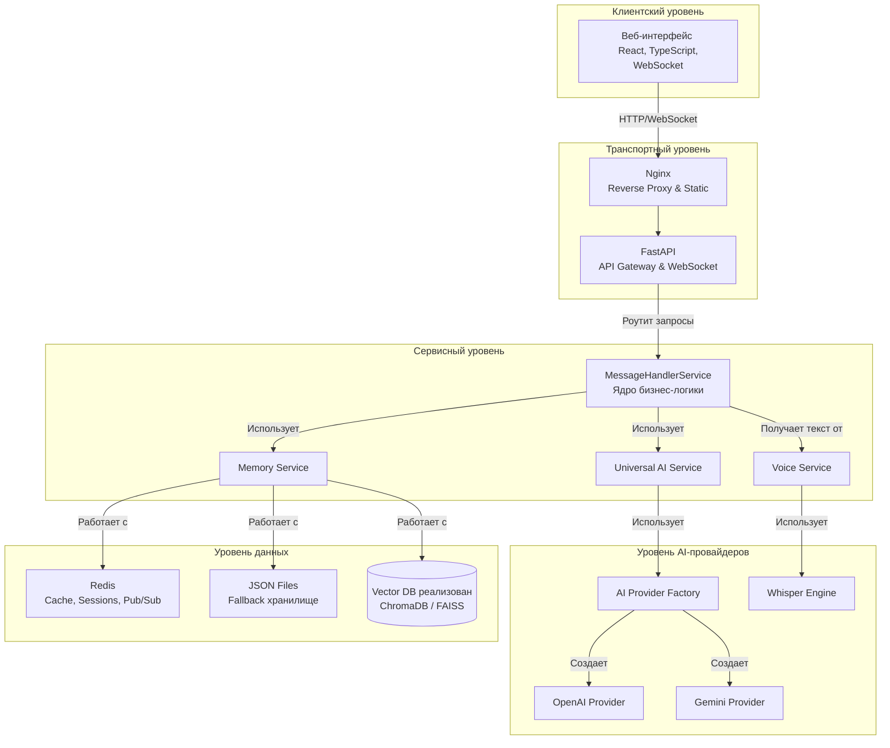

🏗️ AI ChatBot - Архитектурный паспорт
Этот документ описывает архитектуру, компоненты и ключевые проектные решения системы AI ChatBot. Он предназначен для инженеров и архитекторов, работающих над проектом.

1. Философия архитектуры
Провайдеро-независимость: Ядро системы не зависит от конкретного AI-провайдера. Все провайдеры реализуют единый интерфейс BaseAIProvider. Это позволяет легко добавлять новые LLM и сравнивать их.

Разделение ответственности (SoC): Каждый сервис (AIService, MemoryService, VoiceService, MessageHandlerService) отвечает за свою четко определенную бизнес-область. Это упрощает поддержку и тестирование.

Масштабируемость: Архитектура спроектирована с прицелом на горизонтальное масштабирование. Использование Docker, Redis и событийно-ориентированной модели (в перспективе) обеспечивают готовность к высоким нагрузкам.

Конфигурация как код: Поведение системы (личность агента, модели, фича-флаги) управляется через внешние конфигурационные файлы, а не хардкод, что позволяет изменять логику без переразвертывания.

2. Схема архитектуры
> **Примечание:** Nginx — опциональный компонент, используется для продакшн-окружения как reverse proxy и для отдачи статики.



3. Описание компонентов
3.1. Backend (FastAPI)
- **MessageHandlerService:** Ядро бизнес-логики. Оркестрирует взаимодействие между MemoryService и AIService. Освобождает транспортный уровень (API-роутеры) от логики. Использует DI (dependency injection) для внедрения сервисов.
- **AIService:** Сервис-фабрика. Отвечает за инициализацию и выбор AI-провайдера на основе конфигурации. Абстрагирует остальную часть приложения от деталей реализации конкретных LLM. Использует ленивую инициализацию провайдеров.
- **MemoryService:** Абстракция над хранилищем. Отвечает за сохранение, извлечение и управление историей разговоров. Поддерживает несколько бэкендов (JSONStorageBackend, RedisStorageBackend с использованием Sorted Set для масштабируемости).
- **VoiceService:** Интеграция с Whisper. Принимает аудиоданные, выполняет транскрипцию в отдельном процессе (через run_in_executor), чтобы не блокировать основной поток. Статус обработки хранится в Redis для масштабируемости.
- **Models (Pydantic):** Строго типизированные модели данных для запросов, ответов и конфигураций. Обеспечивают валидацию данных "на лету" и автоматическую генерацию документации API.

3.2. Уровень данных
- **Redis:** Основное хранилище для production-режима. Используется для:
  - Истории чатов: Redis List для сообщений, Redis Hash для метаданных, Redis Sorted Set для индексации и пагинации.
  - Кэширования: Кэширование ответов, моделей и т.д.
  - Pub/Sub: Используется как шина событий.
- **JSON Files:** Хранилище по умолчанию для простоты локального запуска. Не рекомендуется для продакшена из-за проблем с производительностью при конкурентной записи.
- **Vector DB:** Реализовано. Специализированная база данных для хранения векторных представлений текста (ChromaDB/FAISS). Используется для реализации долгосрочной памяти агента (RAG).

4. Потоки данных (Data Flows)
4.1. Текстовый чат (WebSocket)
- User -> Frontend: Пользователь вводит текст.
- Frontend -> Backend: WebSocketClient отправляет JSON-сообщение { "type": "chat_message", "data": { ... } } через активное соединение.
- Backend (FastAPI -> MessageHandlerService):
  - Сохраняет сообщение пользователя через MemoryService.
  - Получает контекст диалога (последние N сообщений + релевантные "воспоминания" из Vector DB).
  - Вызывает AIService для генерации ответа.
  - AIService -> LLM: Формирует промпт и получает ответ (стримингом).
- Backend -> Frontend: Ответ AI (токен за токеном) отправляется обратно клиенту через WebSocket-события stream_chunk.
- Frontend -> User: UI обновляется в реальном времени, отображая ответ ассистента.

**Структура WebSocketMessage:**
```json
{
  "type": "chat_message", // или другой тип
  "data": { ... },         // полезная нагрузка
  "session_id": "..."    // идентификатор сессии
}
```
Потоковая передача токенов реализована через события типа `stream_chunk`.

---
Документ актуализирован по состоянию на [дата обновления].

## 5. Безопасность

Безопасность является ключевым аспектом архитектуры AI ChatBot. Применяются следующие подходы:

*   **Аутентификация и Авторизация:** Планируется внедрение механизмов аутентификации (например, JWT) и авторизации (на основе ролей) для защиты чувствительных API-эндпоинтов и WebSocket-соединений.
*   **Управление Секретами:** Конфиденциальные данные (API-ключи, секретные ключи) хранятся в переменных окружения и не хардкодятся в коде. В продакшен-среде обеспечивается строгая валидация для предотвращения использования значений по умолчанию.
*   **CORS и Защита от CSRF/XSS:** FastAPI предоставляет встроенные механизмы для настройки CORS и защиты от распространенных веб-уязвимостей. В продакшен-среде `allowed_hosts` и `cors_origins` будут строго ограничены.
*   **Непривилегированные Пользователи:** Docker-образы запускаются от имени непривилегированного пользователя для минимизации рисков безопасности.

## 6. Мониторинг и Наблюдаемость

Для обеспечения стабильности и производительности системы AI ChatBot реализованы следующие механизмы мониторинга:

*   **Логирование:** Используется `structlog` для структурированного логирования всех ключевых событий и ошибок. Логи могут быть агрегированы и анализированы внешними системами.
*   **Проверки Работоспособности (Health Checks):** Реализованы различные эндпоинты для проверки работоспособности сервисов (`/health`, `/health/detailed`, `/health/readiness`, `/health/liveness`), что позволяет оркестраторам контейнеров (например, Kubernetes) эффективно управлять жизненным циклом приложения.
*   **Метрики:** Планируется внедрение метрик (с использованием Prometheus) для отслеживания производительности системы, таких как время ответа AI, использование памяти, CPU и т.д. Дашборды (Grafana) будут использоваться для визуализации этих метрик.
*   **Трассировка (Tracing):** Рассматривается возможность внедрения распределенной трассировки для отслеживания запросов по всей системе и выявления узких мест.

Документ 3: DEVELOPER_GUIDE.md
