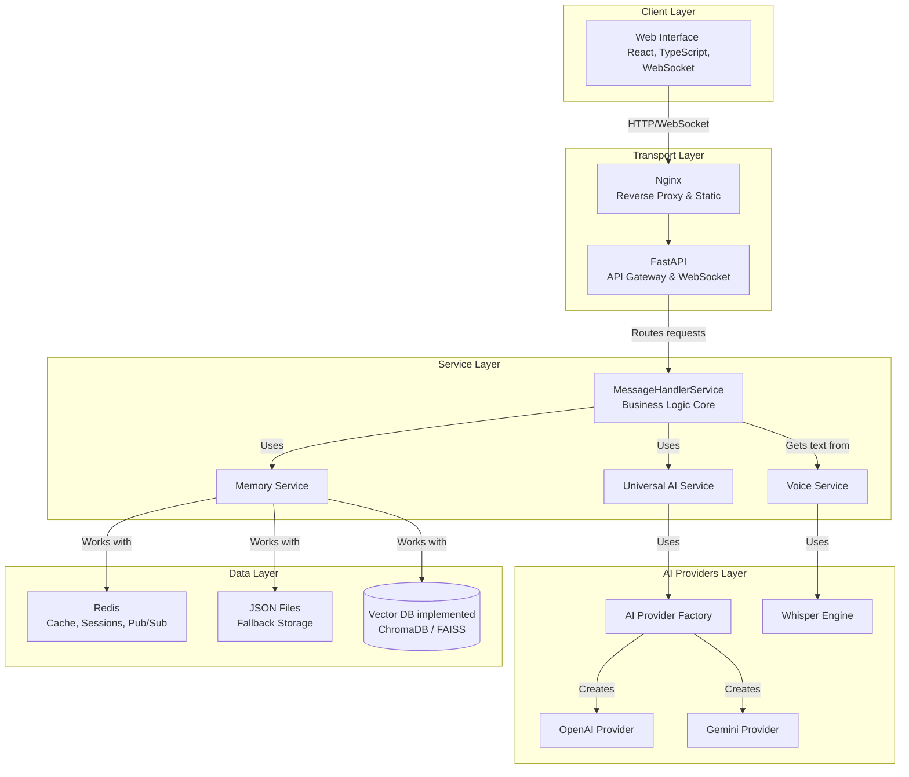

# 🏗️ AI ChatBot - Architecture Passport
This document describes the architecture, components, and key design decisions of the AI ChatBot system. It is intended for engineers and architects working on the project.

## 1. Architecture Philosophy
**Provider-independence:** The system core does not depend on a specific AI provider. All providers implement a unified BaseAIProvider interface. This allows easy addition of new LLMs and comparison between them.

**Separation of Concerns (SoC):** Each service (AIService, MemoryService, VoiceService, MessageHandlerService) is responsible for its own clearly defined business domain. This simplifies maintenance and testing.

**Scalability:** The architecture is designed for horizontal scaling. Use of Docker, Redis, and an event-driven model (in the future) ensure readiness for high loads.

**Configuration as Code:** System behavior (agent persona, models, feature flags) is managed via external configuration files, not hardcoded, allowing logic changes without redeployment.

## 2. Architecture Diagram
> **Note:** Nginx is an optional component, used in production as a reverse proxy and for serving static files.



## 3. Component Descriptions
### 3.1. Backend (FastAPI)
- **MessageHandlerService:** Business logic core. Orchestrates interaction between MemoryService and AIService. Frees the transport layer (API routers) from logic. Uses DI (dependency injection) for service injection.
- **AIService:** Service-factory. Responsible for initializing and selecting the AI provider based on configuration. Abstracts the rest of the app from specific LLM implementations. Uses lazy initialization of providers.
- **MemoryService:** Abstraction over storage. Handles saving, retrieving, and managing conversation history. Supports multiple backends (JSONStorageBackend, RedisStorageBackend with Sorted Set for scalability).
- **VoiceService:** Whisper integration. Accepts audio data, performs transcription in a separate process (via run_in_executor) to avoid blocking the main thread. Processing status is stored in Redis for scalability.
- **Models (Pydantic):** Strictly typed data models for requests, responses, and configs. Provide on-the-fly data validation and automatic API documentation generation.

### 3.2. Data Layer
- **Redis:** Main storage for production mode. Used for:
  - Chat history: Redis List for messages, Redis Hash for metadata, Redis Sorted Set for indexing and pagination.
  - Caching: Caching responses, models, etc.
  - Pub/Sub: Used as an event bus.
- **JSON Files:** Default storage for easy local launch. Not recommended for production due to performance issues with concurrent writes.
- **Vector DB:** Implemented. Specialized database for storing vector representations of text (ChromaDB/FAISS). Used for implementing long-term agent memory (RAG).

## 4. Data Flows
### 4.1. Text Chat (WebSocket)
- User -> Frontend: User enters text.
- Frontend -> Backend: WebSocketClient sends a JSON message { "type": "chat_message", "data": { ... } } via an active connection.
- Backend (FastAPI -> MessageHandlerService):
  - Saves the user's message via MemoryService.
  - Retrieves dialog context (last N messages + relevant "memories" from Vector DB).
  - Calls AIService to generate a response.
  - AIService -> LLM: Forms a prompt and gets a response (streaming).
- Backend -> Frontend: AI response (token by token) is sent back to the client via WebSocket events stream_chunk.
- Frontend -> User: UI updates in real time, displaying the assistant's response.

**WebSocketMessage structure:**
```json
{
  "type": "chat_message", // or another type
  "data": { ... },         // payload
  "session_id": "..."    // session identifier
}
```
Streaming token delivery is implemented via `stream_chunk` events.

---
Document updated as of [update date].

See also: DEVELOPER_GUIDE.md 